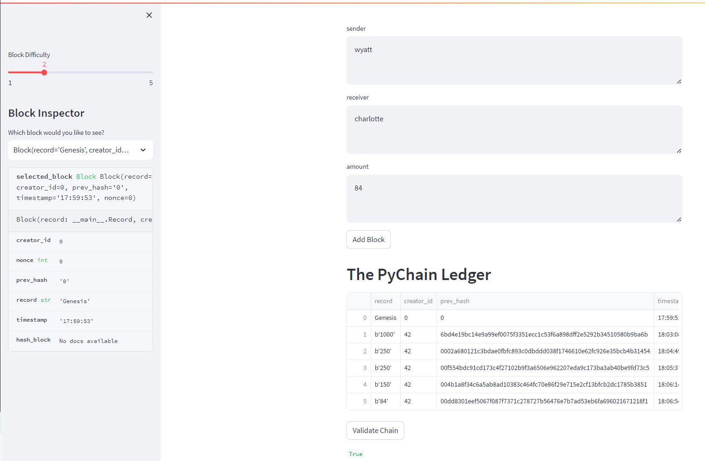

# Blockchain_PyChain_Mod18
PyChain Ledger

In the screenshots below, the attachments reflect 6 different transactions. The streamlit `text_area` input was utilized for the sender, receiver, and the amount. As it relates to the PyChain ledger, the `record` line describes the the transaction amount for each of the transactions.  The `creator_id` is the id of the node system. 

The `prev_hash` represents the unique identifier of the transaction based upon the `sha256` format, while the timestamp was instantiated when we pass through the class `Block` based upon the UTC time as formated based upon hours, minutes, and seconds.  

As transactions are inputted into the `record area`, the transactions are then finalized into the ledger with a hash that is unique to that transaction.  In the screenshot below, you will be able to see the `prev_hash` based upon the `sha256` character code.

